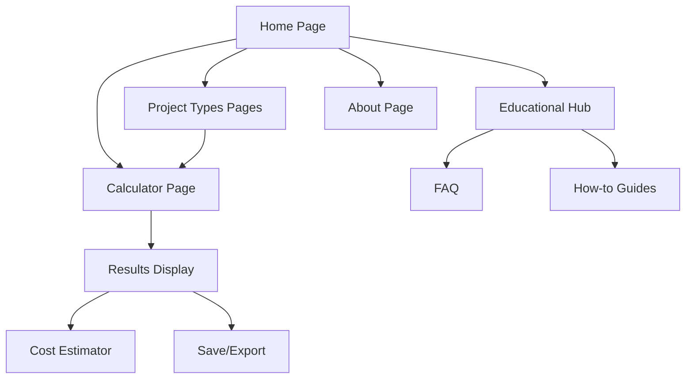

# Concrete Calculator - Product Requirements Document

## 1. Product Overview

A comprehensive online concrete calculator that helps users estimate concrete volume, material quantities, and project costs for various construction projects. The tool serves DIY enthusiasts, contractors, engineers, and building material suppliers by providing accurate calculations for slabs, footings, columns, steps, walls, and driveways.

The product addresses the critical need for precise material estimation in construction projects, helping users avoid waste, optimize costs, and ensure adequate material procurement for successful project completion.

## 2. Core Features

### 2.1 User Roles

| Role | Registration Method | Core Permissions |
|------|---------------------|------------------|
| Anonymous User | No registration required | Can use all calculator functions, view results, access educational content |
| Registered User | Email registration (optional) | Can save calculations, access calculation history, customize default settings |

### 2.2 Feature Module

Our concrete calculator website consists of the following main pages:

1. **Home Page**: Hero section with main calculator tool, featured project types, benefits overview, and quick start guide
2. **Calculator Page**: Interactive calculation forms for different project types, unit conversion, results display with detailed breakdown
3. **Project Types Pages**: Dedicated pages for specific calculations (slab, footing, steps, driveway, wall, column)
4. **Cost Estimator Page**: Advanced cost calculation with regional pricing, material breakdown, and budget planning tools
5. **Educational Hub**: How-to guides, concrete basics, project planning tips, and frequently asked questions
6. **About Page**: Company information, tool accuracy details, and contact information

### 2.3 Page Details

| Page Name | Module Name | Feature Description |
|-----------|-------------|---------------------|
| Home Page | Hero Section | Display main value proposition, primary CTA button, background construction imagery |
| Home Page | Quick Calculator | Provide basic rectangular slab calculator with instant results preview |
| Home Page | Project Types Grid | Show 6 main project types with icons, brief descriptions, and navigation links |
| Home Page | Benefits Section | Highlight time savings, cost accuracy, waste reduction, and professional reliability |
| Calculator Page | Project Type Selector | Allow users to choose from slab, footing, column, steps, wall, driveway calculations |
| Calculator Page | Dimension Input Forms | Collect length, width, height, diameter, thickness based on selected project type |
| Calculator Page | Unit Conversion Toggle | Switch between metric (m³) and imperial (yd³) measurement systems |
| Calculator Page | Results Display | Show concrete volume, cement bags needed, estimated cost with detailed breakdown |
| Calculator Page | Save & Share | Enable calculation saving, PDF export, and social sharing functionality |
| Project Types Pages | Specialized Forms | Provide project-specific input fields and calculation logic for each construction type |
| Project Types Pages | Visual Guides | Display diagrams, measurement illustrations, and step-by-step instructions |
| Cost Estimator Page | Regional Pricing | Allow location-based pricing adjustments and local supplier integration |
| Cost Estimator Page | Material Breakdown | Show detailed cement, sand, gravel quantities and individual costs |
| Cost Estimator Page | Budget Planning | Provide total project cost estimation including labor and delivery fees |
| Educational Hub | How-to Guides | Offer comprehensive tutorials for concrete mixing, pouring, and finishing |
| Educational Hub | FAQ Section | Answer common questions about concrete calculations, materials, and best practices |
| Educational Hub | Concrete Basics | Explain concrete types, strength grades, curing processes, and quality factors |
| About Page | Company Info | Present tool accuracy, calculation methodology, and professional credentials |
| About Page | Contact Form | Enable user inquiries, feedback submission, and technical support requests |

## 3. Core Process

**Main User Flow:**

1. User visits homepage and sees the main calculator interface
2. User selects project type (slab, footing, column, etc.) from dropdown or dedicated page
3. User inputs project dimensions using intuitive form fields
4. User selects preferred measurement units (metric/imperial)
5. System calculates and displays concrete volume, material quantities, and estimated costs
6. User can adjust parameters, save results, or export calculations
7. User can access educational content for project guidance and best practices

**Advanced User Flow:**

1. Registered users can save multiple calculations and access calculation history
2. Users can customize default settings (units, regional pricing, material preferences)
3. Users can generate detailed reports with material lists and cost breakdowns

## 4. User Interface Design

### 4.1 Design Style

- **Primary Colors**: Construction orange (#FF6B35) for CTAs and highlights, professional blue (#2C5282) for headers and navigation
- **Secondary Colors**: Neutral grays (#F7FAFC, #E2E8F0, #4A5568) for backgrounds and text, success green (#38A169) for results
- **Button Style**: Rounded corners (8px radius), solid fills for primary actions, outlined style for secondary actions
- **Typography**: Inter font family, 16px base size, clear hierarchy with 24px/32px/48px for headings
- **Layout Style**: Clean card-based design, responsive grid system, prominent white space for clarity
- **Icons**: Construction-themed line icons, calculator symbols, measurement indicators

### 4.2 Page Design Overview

| Page Name | Module Name | UI Elements |
|-----------|-------------|-------------|
| Home Page | Hero Section | Full-width background image of construction site, centered headline text (48px), prominent orange CTA button, clean overlay design |
| Home Page | Quick Calculator | White card with subtle shadow, organized input fields, real-time calculation display, blue accent borders |
| Calculator Page | Input Forms | Grouped form sections, labeled input fields with units, dropdown selectors, toggle switches for unit conversion |
| Calculator Page | Results Panel | Highlighted results card, color-coded metrics, progress indicators, breakdown tables with clear typography |
| Project Types Pages | Visual Guides | Illustrated diagrams, step-by-step layouts, measurement callouts, responsive image galleries |
| Educational Hub | Content Layout | Article-style typography, code blocks for formulas, expandable FAQ sections, search functionality |

### 4.3 Responsiveness

The website follows a mobile-first approach with responsive breakpoints at 640px, 768px, 1024px, and 1280px. Touch-optimized interactions include larger tap targets (44px minimum), swipe gestures for mobile navigation, and optimized form inputs for mobile keyboards. The calculator interface adapts to smaller screens with collapsible sections and streamlined input flows.