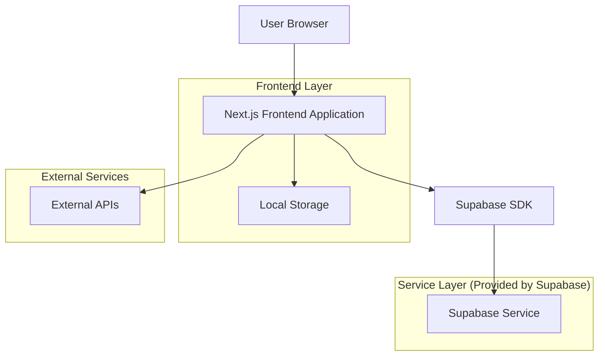
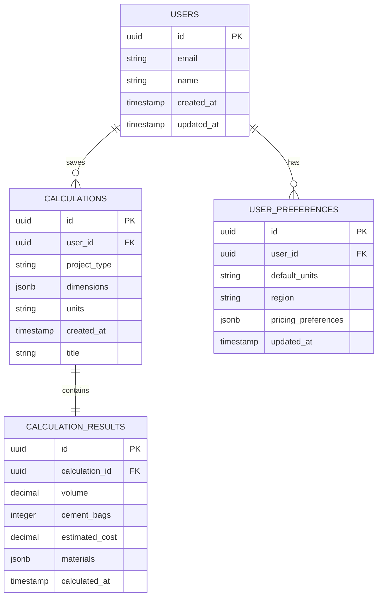

# Concrete Calculator - Technical Architecture Document

## 1. Architecture Design



## 2. Technology Description

- Frontend: Next.js@15 + React@18 + TailwindCSS@4 + TypeScript@5
- Backend: Supabase (Authentication, Database, Storage)
- State Management: React Context + Local Storage
- SEO: Next.js built-in SEO features + next-sitemap
- Analytics: Vercel Analytics (optional)
- Deployment: Vercel Platform

## 3. Route Definitions

| Route | Purpose |
|-------|---------|
| / | Home page with hero section and quick calculator |
| /calculator | Main calculator page with all project types |
| /calculator/slab | Concrete slab calculator with specialized inputs |
| /calculator/footing | Foundation footing calculator |
| /calculator/column | Column/pillar concrete calculator |
| /calculator/steps | Stairs concrete calculator |
| /calculator/wall | Wall concrete calculator |
| /calculator/driveway | Driveway concrete calculator |
| /cost-estimator | Advanced cost calculation and material breakdown |
| /guides | Educational hub with how-to guides |
| /guides/[slug] | Individual guide pages |
| /faq | Frequently asked questions |
| /about | About page with company information |
| /api/calculations | API endpoint for saving calculations (if user registration implemented) |

## 4. API Definitions

### 4.1 Core API

Calculation Storage (Optional - for registered users)
```
POST /api/calculations
```

Request:
| Param Name | Param Type | isRequired | Description |
|------------|------------|------------|-------------|
| projectType | string | true | Type of project (slab, footing, column, etc.) |
| dimensions | object | true | Project dimensions and measurements |
| units | string | true | Measurement units (metric/imperial) |
| results | object | true | Calculated results (volume, materials, cost) |
| userId | string | false | User ID if authenticated |

Response:
| Param Name | Param Type | Description |
|------------|------------|-------------|
| success | boolean | Operation success status |
| calculationId | string | Unique calculation identifier |
| savedAt | string | Timestamp of save operation |

Example Request:
```json
{
  "projectType": "slab",
  "dimensions": {
    "length": 10,
    "width": 8,
    "thickness": 0.1
  },
  "units": "metric",
  "results": {
    "volume": 8.0,
    "cementBags": 32,
    "estimatedCost": 960
  }
}
```

### 4.2 Calculation Functions (Client-side)

Core calculation utilities implemented as TypeScript functions:

```typescript
// Volume calculations for different shapes
interface SlabDimensions {
  length: number;
  width: number;
  thickness: number;
}

interface ColumnDimensions {
  diameter: number;
  height: number;
}

interface StepsDimensions {
  width: number;
  length: number;
  height: number;
  numberOfSteps: number;
}

// Calculation results interface
interface CalculationResults {
  volume: number; // in cubic meters or cubic yards
  cementBags: number; // 50kg or 80lb bags
  estimatedCost: number; // in local currency
  materials: {
    cement: number;
    sand: number;
    gravel: number;
  };
}
```

## 5. Data Model

### 5.1 Data Model Definition



### 5.2 Data Definition Language

User Table (users)
```sql
-- Create users table
CREATE TABLE users (
    id UUID PRIMARY KEY DEFAULT gen_random_uuid(),
    email VARCHAR(255) UNIQUE NOT NULL,
    name VARCHAR(100) NOT NULL,
    created_at TIMESTAMP WITH TIME ZONE DEFAULT NOW(),
    updated_at TIMESTAMP WITH TIME ZONE DEFAULT NOW()
);

-- Enable RLS
ALTER TABLE users ENABLE ROW LEVEL SECURITY;

-- Create policies
CREATE POLICY "Users can view own profile" ON users
    FOR SELECT USING (auth.uid() = id);

CREATE POLICY "Users can update own profile" ON users
    FOR UPDATE USING (auth.uid() = id);
```

Calculations Table (calculations)
```sql
-- Create calculations table
CREATE TABLE calculations (
    id UUID PRIMARY KEY DEFAULT gen_random_uuid(),
    user_id UUID REFERENCES users(id) ON DELETE CASCADE,
    project_type VARCHAR(50) NOT NULL CHECK (project_type IN ('slab', 'footing', 'column', 'steps', 'wall', 'driveway')),
    dimensions JSONB NOT NULL,
    units VARCHAR(20) NOT NULL CHECK (units IN ('metric', 'imperial')),
    title VARCHAR(200),
    created_at TIMESTAMP WITH TIME ZONE DEFAULT NOW()
);

-- Create indexes
CREATE INDEX idx_calculations_user_id ON calculations(user_id);
CREATE INDEX idx_calculations_project_type ON calculations(project_type);
CREATE INDEX idx_calculations_created_at ON calculations(created_at DESC);

-- Enable RLS
ALTER TABLE calculations ENABLE ROW LEVEL SECURITY;

-- Create policies
CREATE POLICY "Users can view own calculations" ON calculations
    FOR SELECT USING (auth.uid() = user_id);

CREATE POLICY "Users can insert own calculations" ON calculations
    FOR INSERT WITH CHECK (auth.uid() = user_id);

CREATE POLICY "Users can update own calculations" ON calculations
    FOR UPDATE USING (auth.uid() = user_id);

CREATE POLICY "Users can delete own calculations" ON calculations
    FOR DELETE USING (auth.uid() = user_id);

-- Grant permissions
GRANT SELECT ON calculations TO anon;
GRANT ALL PRIVILEGES ON calculations TO authenticated;
```

Calculation Results Table (calculation_results)
```sql
-- Create calculation_results table
CREATE TABLE calculation_results (
    id UUID PRIMARY KEY DEFAULT gen_random_uuid(),
    calculation_id UUID REFERENCES calculations(id) ON DELETE CASCADE,
    volume DECIMAL(10,3) NOT NULL,
    cement_bags INTEGER NOT NULL,
    estimated_cost DECIMAL(10,2),
    materials JSONB,
    calculated_at TIMESTAMP WITH TIME ZONE DEFAULT NOW()
);

-- Create indexes
CREATE INDEX idx_calculation_results_calculation_id ON calculation_results(calculation_id);

-- Enable RLS
ALTER TABLE calculation_results ENABLE ROW LEVEL SECURITY;

-- Create policies
CREATE POLICY "Users can view results of own calculations" ON calculation_results
    FOR SELECT USING (
        EXISTS (
            SELECT 1 FROM calculations 
            WHERE calculations.id = calculation_results.calculation_id 
            AND calculations.user_id = auth.uid()
        )
    );

CREATE POLICY "Users can insert results for own calculations" ON calculation_results
    FOR INSERT WITH CHECK (
        EXISTS (
            SELECT 1 FROM calculations 
            WHERE calculations.id = calculation_results.calculation_id 
            AND calculations.user_id = auth.uid()
        )
    );

-- Grant permissions
GRANT SELECT ON calculation_results TO anon;
GRANT ALL PRIVILEGES ON calculation_results TO authenticated;
```

User Preferences Table (user_preferences)
```sql
-- Create user_preferences table
CREATE TABLE user_preferences (
    id UUID PRIMARY KEY DEFAULT gen_random_uuid(),
    user_id UUID REFERENCES users(id) ON DELETE CASCADE UNIQUE,
    default_units VARCHAR(20) DEFAULT 'metric' CHECK (default_units IN ('metric', 'imperial')),
    region VARCHAR(100),
    pricing_preferences JSONB DEFAULT '{}',
    updated_at TIMESTAMP WITH TIME ZONE DEFAULT NOW()
);

-- Create indexes
CREATE INDEX idx_user_preferences_user_id ON user_preferences(user_id);

-- Enable RLS
ALTER TABLE user_preferences ENABLE ROW LEVEL SECURITY;

-- Create policies
CREATE POLICY "Users can view own preferences" ON user_preferences
    FOR SELECT USING (auth.uid() = user_id);

CREATE POLICY "Users can update own preferences" ON user_preferences
    FOR ALL USING (auth.uid() = user_id);

-- Grant permissions
GRANT SELECT ON user_preferences TO anon;
GRANT ALL PRIVILEGES ON user_preferences TO authenticated;

-- Insert default preferences function
CREATE OR REPLACE FUNCTION create_user_preferences()
RETURNS TRIGGER AS $$
BEGIN
    INSERT INTO user_preferences (user_id, default_units, region)
    VALUES (NEW.id, 'metric', 'US');
    RETURN NEW;
END;
$$ LANGUAGE plpgsql;

-- Create trigger for new users
CREATE TRIGGER create_user_preferences_trigger
    AFTER INSERT ON users
    FOR EACH ROW
    EXECUTE FUNCTION create_user_preferences();
```